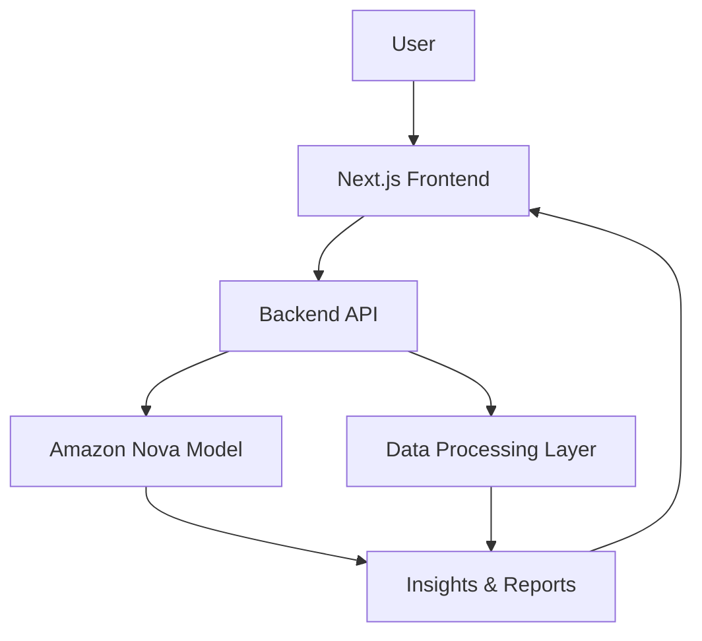

# 🚀 NovaCopilot

NovaCopilot is an AI-powered business intelligence assistant that helps startups and small businesses analyze their data, generate insights, and make smarter decisions using generative AI.

Built using Amazon Nova models, NovaCopilot transforms raw business data into clear, actionable insights through an intuitive dashboard and conversational AI interface.

## 🧠 Problem

Small businesses collect a large amount of operational data, including:
- Sales reports
- Customer feedback
- Marketing performance
- Product analytics

However, most teams lack the expertise or time to analyze this data effectively. As a result, valuable insights remain hidden inside spreadsheets and documents.

## 💡 Solution

NovaCopilot acts as an AI business assistant that helps users quickly understand their data.

Users can:
- Upload datasets such as CSV or Excel files
- Ask questions using a conversational AI interface
- Automatically analyze sales and customer trends
- Generate actionable insights and reports

The goal is to make data-driven decision making accessible to everyone.

## ✨ Features

- **🤖 AI Chat Assistant**: Ask questions about your business data and receive intelligent insights instantly.
- **📊 Data Analysis**: Upload datasets and let AI analyze trends, patterns, and performance.
- **📈 Insights Dashboard**: Visualize important business metrics through charts and analytics.
- **📁 File Upload**: Upload CSV, Excel, or document data for AI-powered analysis.
- **🧾 AI Generated Reports**: Automatically generate summaries and strategic recommendations.

## 🏗 Architecture



## 🛠 Tech Stack

**Frontend**
- Next.js
- TypeScript
- Tailwind CSS
- shadcn/ui

**Backend**
- Node.js / API Routes

**AI & Cloud**
- Amazon Nova models via AWS services

**Data Processing**
- CSV / Excel dataset parsing

## 📷 Application Screens

- **Dashboard Overview**: Displays business performance metrics and AI insights.
- **AI Chat Assistant**: Conversational interface to ask questions about business data.
- **Data & Insights Hub**: Upload datasets and generate insights.

## ⚙️ Installation

Clone the repository:
```bash
git clone https://github.com/Siddiquiashrafhussain/novacopilot.git
```

Navigate to the project folder:
```bash
cd novacopilot
```

Install dependencies:
```bash
npm install
# or
pnpm install
```

Run the development server:
```bash
npm run dev
# or
pnpm run dev
```

Open the app in your browser:
[http://localhost:3000](http://localhost:3000)

## 🎯 Use Cases

NovaCopilot can help:
- Startup founders
- Small business owners
- Product managers
- Marketing teams
- Business analysts

by transforming raw data into clear strategic insights.

## 🚧 Challenges

While building NovaCopilot, we faced challenges in:
- Designing prompts that produce meaningful business insights
- Processing structured datasets for AI analysis
- Creating a simple but powerful user interface

These challenges helped us learn how to better combine AI reasoning with data analytics.

## 🏆 Accomplishments

We successfully built a working prototype that demonstrates how generative AI can:
- Analyze business data
- Provide intelligent recommendations
- Simplify decision-making for businesses

NovaCopilot shows the potential of AI-powered business assistants.

## 📚 What We Learned

During development we learned:
- How to integrate generative AI models into web applications
- The importance of prompt design for better AI responses
- How to build user-friendly dashboards for complex analytics

## 🔮 Future Improvements

Next versions of NovaCopilot may include:
- Real-time business analytics dashboards
- Predictive sales forecasting
- CRM and marketing platform integrations
- Voice-based AI assistant
- Automated report generation

Our vision is to build a complete AI copilot for business operations.

## 📄 License

This project is licensed under the MIT License.

## 👨‍💻 Author

**Ashraf Hussain Siddiqui**
- GitHub: [https://github.com/Siddiquiashrafhussain](https://github.com/Siddiquiashrafhussain)
- LinkedIn: [https://www.linkedin.com/in/ashraf-hussain-siddiqui-66a1242b2/](https://www.linkedin.com/in/ashraf-hussain-siddiqui-66a1242b2/)
